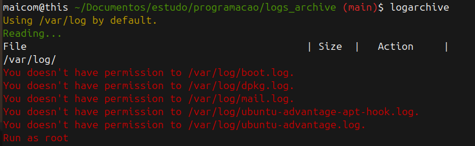
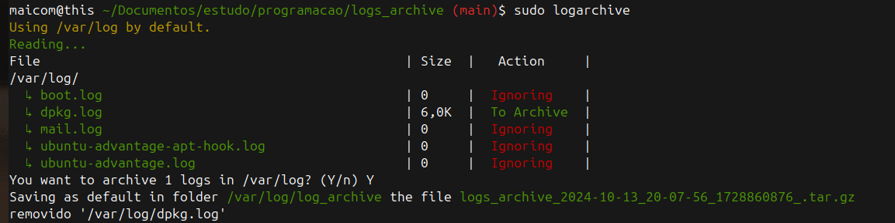
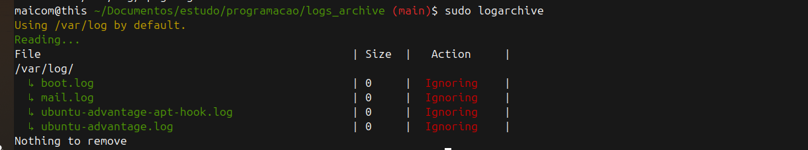

# Log Archive Tool 

A project made for https://roadmap.sh/projects/log-archive-tool

**Demand:**
"In this project, you will build a tool to archive logs on a set schedule by compressing them and storing them in a new directory, this is especially useful for removing old logs and keeping the system clean while maintaining the logs in a compressed format for future reference. This project will help you practice your programming skills, including working with files and directories, and building a simple cli tool."

### Usage:

```
    log-archive <log-directory>
    # will compact all logs into /var/logs/log_archive/.tar.gz 
```

### Running without root

### Running and delete an file

### nothing to do



### Install:

_From deb:_
```
wget https://github.com/maicomferre/-Log-Archive-Tool/releases/download/0.0.1/logs-archive_0.0.1-1_amd64.deb

sudo apt install ./log-archive-tool

logarchive [/path/log]

```

_From source:_
```
wget https://github.com/maicomferre/-Log-Archive-Tool/releases/latest

sudo /log-archive.sh [/path/log]

```